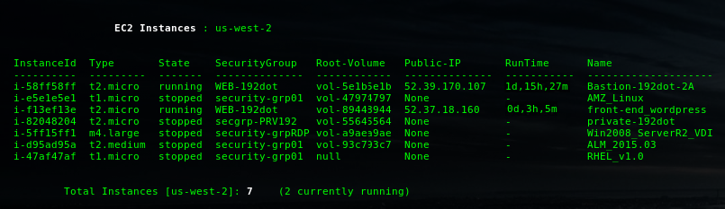
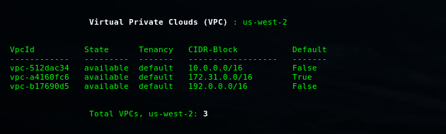
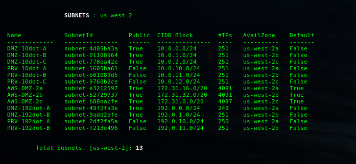
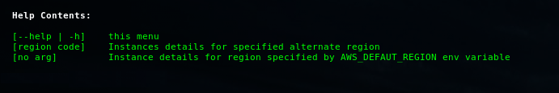
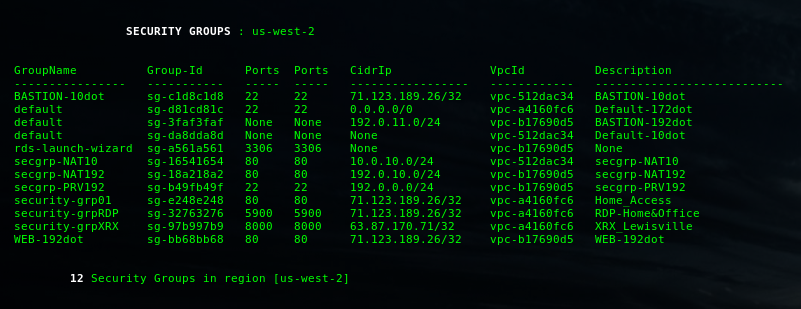
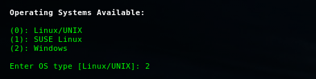
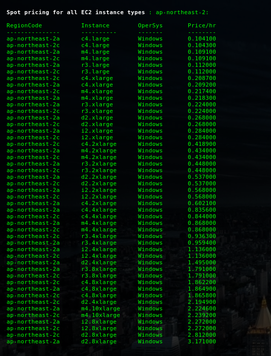

# EC2 CLI Utilities  

* [About](#about-this-repository)
* [License](#license)
* [Introduction](#introduction)
* [Conventions](#conventions)
* [Contents](#contents)
* [Installation](#installation)
* [Configuration](#configuration)
* [Permissions](#iam-permissions)
* [Screenshots](#screenshots)
* [Aliases (optional)](#aliases-(\optional)\)
* [Contribution Guidelines](#contribution-guidelines)
* [Contact](#contact)

* * *

## About this repository 

* Purpose:  	CLI utilities for use with Amazon Web Services (AWS)
* Version:	05/2016
* Repo: 	[ec2cli] https://blakeca00@bitbucket.org/blakeca00/ec2cli.git 

* * *

## License 

* All utilities contained herein are copyrighted and made available under GPLv2
* See [LICENSE](https://www.gnu.org/licenses/gpl-2.0.html)

* * *

## Introduction 

EC2cli Utilities were developed to make life easier when working with AWS services
in a cli environment.  The scripts utilize AWS' cli tools to enable you to send signed 
requests to Amazon's API to perform uses cases previously performed using the 
console interface.  Using these will save time and effort to perform operations
such as taking a snapshot or listing which EC2 instances are running.

That being said, the scripts in this repo are designed for use with relatively low AWS resource counts.  In other words, if you are operating at scale and have 1000 EBS volumes, these will prove cumbersome since are no embedded filtering capabilities (if you would like to contribute, please see "Contributing" below).  The assumption is that if you are operating at scale, you have already developed your own tools for managing and operating AWS resources in a commercial environment.

While I realize that accomplishing the same functionality these scripts provide is far easier with the AWS ruby or python SDK's, I developed these in bash to make them easy for system administrators and solution architects to modify for their particular use cases.

_Dependency Note_:  these utilities were developed and tested under bash.  Some 
may work with other shells; however, your mileage may vary.



(See [Screenshots](#screenshots) section below)

* * *

## Conventions ##

* "qv" in the filename means "Quick view", a read only (ro) report


* "X" in the filename indicates "Executable".  These make permanent changes to your 
      account resources such as creating a snapshot or mounting a new partition.  Use 
      with caution.  Your IAM user must have rw permissions on the respective
      resources you wish to add or modify using X scripts.

* * *

## Contents ##
```bash
* ec2-qv-AMIs.sh                # Quick view list of all AMI's associated with default region
* ec2-qv-instances.sh           # Quick view list of all EC2 instances in the default region 
* ec2-qv-securitygroups.sh      # Quick view list of all security groups associated
* ec2-qv-snapshots.sh           # Quick view list of all snapshots in default region
* ec2-qv-spot-prices.sh         # Quick view of spot prices in a region you specify
* ec2-qv-subnets.sh             # Quick view of subnets in the default region
* ec2-qv-tags.sh                # Quick view of EC2 tags
* ec2-qv-volumes.sh             # Quick view list of all volumes in the default region
* ec2-qv-vpc.sh                 # Quick view list of all default region vpc's
* ec2-X-attach-volume.sh        # Utility for attaching a volume to an instance
* ec2-X-rdp-desktop.sh          # Client utility for starting a windows RDP instance
* ec2-X-start-instance.sh       # Utility for starting an EC2 instance from a list
* ec2-X-take-snapshot.sh        # Utility for taking snapshots

# init/ 

* motd-ec2.sh                   # dynamic message of the day for EC2 instances. Dep on ec2-az-location.sh
* ec2-hostname.sh               # resets EC2 hostname upon (re)start, part of init process
* ec2-az-location.sh            # grabs region from metadata service. Called by motd-ec2.sh
* ec2.bash_profile              # sample from my EC2 bash_profile
```

* * *

## Installation ##

* General Dependencies
	- Writable directory where utilities are located
	- One of the following python versions: 2.6.5, 2.7.X+, 3.3.X+, 3.4.X+
	- Installation Amazon CLI tools (awscli, see below this section)
	- awk, see your dist repo
	- sed, see your dist repo

* Install jq, a JSON parser from your local distribution repository.
```bash
	$ sudo apt-get install jq    # Ubuntu, Ubuntu-based distributions
```
```bash
	$ sudo yum install jq        # RedHat, Fedora, CentOS 
```

* Environment variables: 
	Setup the following global environment variables by adding each to your
	.bashrc or .bash_profile
```bash                              
	# .bashrc 

	export EC2_REPO=~/git/ec2cli           # location of this README and utilities (writable)
	export SSH_KEYS=~/AWS                  # location of ssh access keys (.pem files)
	export EC2_BASE=/usr/local/ec2         # location of host-based init scripts
	export AWS_ACCESS_KEY=XXXXXXXXXXXXX    # Your IAM Access Key
	export AWS_SECRET_KEY=XXXXXXXXXXXXX    # Your Secret Key
	export AWS_DEFAULT_REGION=us-west-2    # Primary AWS Region  
```

* Install [awscli](https://github.com/aws/aws-cli/)
	
	Detailed instructions can be found in the README located at:
	https://github.com/aws/aws-cli/

	The easiest method, provided your platform supports it, is via [pip](http://www.pip-installer.org/en/latest).

```bash
	$ sudo pip install awscli
```

* If you have the aws-cli installed and want to upgrade to the latest version you can run:

```bash
	$ sudo pip install --upgrade awscli
```

* Clone this git repo in a writeable directory:

```bash
	$ git clone https://blakeca00@bitbucket.org/blakeca00/ec2cli.git
```

* Setup shortcut aliases (optional, see [Aliases (optional)](#Aliases) below)

* * *

## Configuration ##

* Configure awscli running the aws configure command:

```bash
   $ aws configure
	
	AWS Access Key ID: foo
	AWS Secret Access Key: bar
	Default region name [us-west-2]: us-west-2
	Default output format [None]: json
```

* Alternatively, to configure awscli using environment variables, do the following:

```bash
	$ export AWS_ACCESS_KEY_ID=<access_key>
	$ export AWS_SECRET_ACCESS_KEY=<secret_key>
```

* A 3rd alternate, is to use a configuration file like this:

```bash
	[default]
	aws_access_key_id=<default access key>
	aws_secret_access_key=<default secret key>
```

* Optional, define a default region for a specific profile by placing the following in ~/.aws/config:

```bash
	[profile testing]
	aws_access_key_id=<testing access key>
	aws_secret_access_key=<testing secret key>
	region=us-west-2
```

* Command Completion 
   	
	You'll want to enable command completion to make awscli
	commands easy to type and recall.  After installing awscli,
	add the following to your .bashrc or .bash_profile:

```bash
	# .bashrc
	complete -C aws_completer aws
```

* * *
 
## IAM Permissions ##

#### Quickview Script Required Permissions 
You'll need appropriate IAM permissions to execute these scripts.  Quickview scripts ("qv" in the filename) simply display data, so by nature require only read only permissions:

```json
{
    "Version": "2012-10-17",
    "Statement": [
        {
            "Effect": "Allow",
            "Action": "ec2:Describe*",
            "Resource": "*"
        },
        {
            "Effect": "Allow",
            "Action": "elasticloadbalancing:Describe*",
            "Resource": "*"
        },
        {
            "Effect": "Allow",
            "Action": [
                "cloudwatch:ListMetrics",
                "cloudwatch:GetMetricStatistics",
                "cloudwatch:Describe*"
            ],
            "Resource": "*"
        },
        {
            "Effect": "Allow",
            "Action": "autoscaling:Describe*",
            "Resource": "*"
        }
    ]
}

```

#### Execute Script Required Permissions 
Execute scripts (marked with an "X" in the filename), require additional permissions in addition to the above to actually affect changes to your infrastructure:

```json
{
    "Version": "2012-10-17",
    "Statement": [
        {
            "Sid": "Stmt1454688142000",
            "Effect": "Allow",
            "Action": [
                "ec2:AttachVolume",
                "ec2:CreateKeyPair",
                "ec2:CreateSecurityGroup",
                "ec2:CreateSnapshot",
                "ec2:DeleteSnapshot",
                "ec2:DetachVolume",
                "ec2:RunInstances",
                "ec2:StartInstances",
                "ec2:StopInstances"
            ],
            "Resource": [
                "*"
            ]
        }
    ]
}

```

You can grab the quickview policy [here](./policies/iampolicy-EC2-quickview.json) or the combined IAM policy for all scripts [here](./policies/iampolicy-EC2-full.json).

* * *

## Aliases (Optional) ##

Add the following to your .bash_profile or .bashrc as convenient cli shortcuts:
```bash
# User Aliases - AWS
alias ec2a="sh $EC2_REPO/ec2-qv-AMIs.sh"                 # list of AMIs
alias ec2i="sh $EC2_REPO/ec2-qv-instances.sh"            # list of instances
alias ec2s="sh $EC2_REPO/ec2-qv-snapshots.sh"            # list of snapshots
alias ec2sg="sh $EC2_REPO/ec2-qv-securitygroups.sh"      # list of sec groups
alias ec2sub="sh $EC2_REPO/ec2-qv-subnets.sh"            # list of subnets
alias ec2v="sh $EC2_REPO/ec2-qv-volumes.sh"              # list of EBS vols
alias ec2vpc="sh $EC2_REPO/ec2-qv-vpc.sh"                # list of VPCs
alias awsnet="ec2vpc && ec2sub && ec2sg"                 # Networking config
```
* * *

## Screenshots ##
#### Quickview Utilities #####
All quickview scripts display AWS resources for your default region unless an alternate region is given as a parameter.

*Note: commands shown assume short notation specified in "Aliases (Optional)" section above*
 
```bash
$ ec2vpc    # default aws region, us-west-2
```


```bash
$ ec2vpc eu-west-1    # alternate (non-default) region given as parameter
```


```bash
$ ec2sub
```


```bash
$ ec2sub eu-west-1    # alt region specified
```


```bash
$ ec2i    # no running instances  
```


```bash
$ ec2i    # running instances
```


```bash
$ ec2i --help     
```


```bash
$ ec2v
```


```bash
$ ec2s
```


```bash
$ ec2sg
```


```bash
$ ec2sg us-east-1    # alt region specified
```


#### Quickview -- Spot Prices ###
```bash
$ sh ec2-qv-spot-prices.sh
```
1.Select region for which you wish to view spot prices (default region auto selected via environment variables): 


2.Select Operating System:   



3.Select a specific instance type or all instances.


4a.If specific instance type selected:


4b.If default [all] selected, output is an ordered list (increasing):



#### Execute Utilities ####

[Screenshots](./readme_x-scripts.md)

* * *

## Contribution Guidelines ##

   In header of most utilities, there is a FUTURE section
   containing feature enhancements so these utilities can stand
   alone.

   If you'd like to contribute, please fork and then send me 
   a pull request.

* * *

## Contact ##

* Repo owner:  Blake Huber // @B1akeHuber
