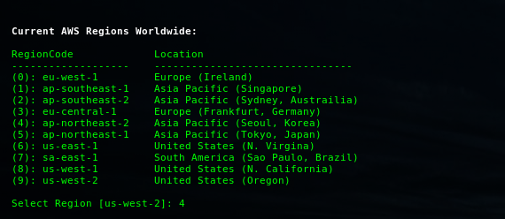
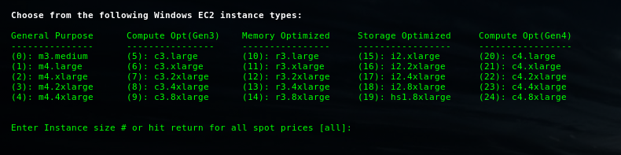
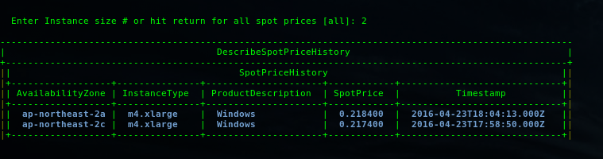

## Screenshots (continued) ##

#### Quickview Spot Price Utility ###

```bash

$ ec2cli --spot

```
1.Select region for which you wish to view spot prices (default region auto selected via environment variables):

[](https://images.awspros.world/ec2cli/spotprice_region.png)

2.Select Operating System:

[](https://images.awspros.world/ec2cli/spotprice_os.png)

3.Select a specific instance type or all instances.

[](https://images.awspros.world/ec2cli/spotprice_types.png)

4a.If specific instance type selected:

[](https://images.awspros.world/ec2cli/spotprice_1instance.png)

4b.If default [all] selected, output is an ordered list (increasing):

[](https://images.awspros.world/ec2cli/spotprice_all.png)

( [Back to README](./README.md) )

* * *
